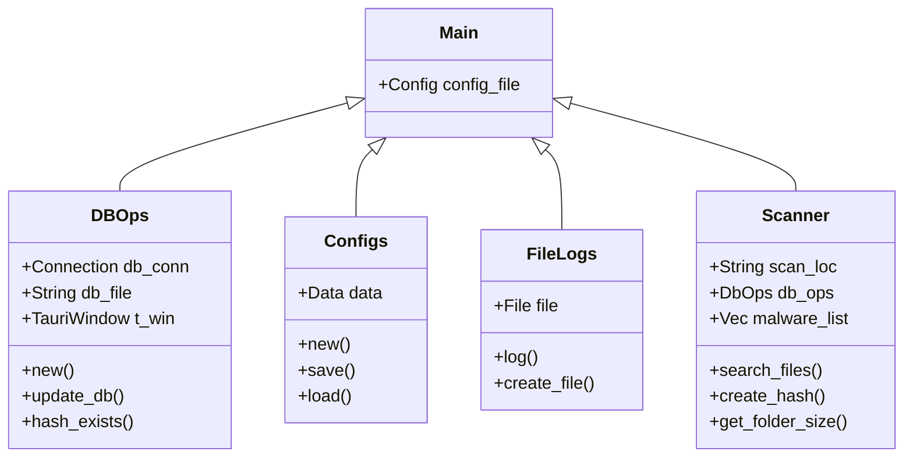

# Architecture

This page visualizes the general structure of the Raspirus project and its setup:

```mermaid
graph LR
     A[Start] --> B{Scan-Position angegeben? ;
     B --> |Ja| C[Start scan];
     C --> |Start Loop| D[Datei gefunden];
     D --> E[Erstelle Hash];
     E --> F[Vergleiche Hash];
     F --> G{Hash in DB? ;
     G --> |Ja| H[Flagge als Malware];
     G --> |Nein| I[Flagge als Safe];
     H & I --> J[Iteration fortsetzen];
     J --> K{Letzte Datei? ;
     K --> |Ja| L[Scanner stoppen];
     L --> M[Ergebnisse anzeigen];
     K --> | N[No| Erneut starten];
     N --> D;
     B --> |Nein | O[Stop]
```

Generally, we use a frontend-backend architecture, with both components written in Rust. The frontend uses the Leptos framework and communicates with the backend via Tauri through WebAssembly

## Backend



## Frontend

<iframe title="The original Raspirus project on Figma" style="border: 1px solid rgba(0, 0, 0, 0.1);" width="800" height="450" src="https://www.figma.com/embed?embed_host=share&url=https%3A%2F%2Fwww.figma.com%2Ffile%2FpkgpwieNbhYiOi4Gz6Uyt6%2FRaspirus%3Fnode-id%3D0%253A1%26t%3DGr4YG3Ynv24YVlz2-1" allowfullscreen></iframe> 

The visualization has evolved over the course of the project, but the page structure remains consistent.
