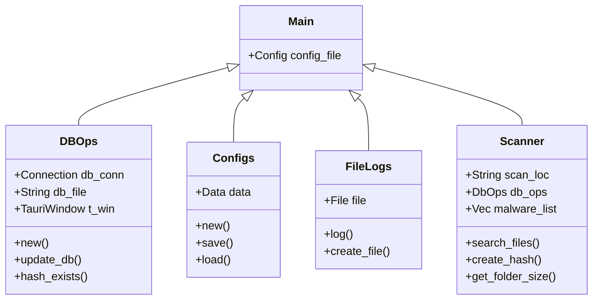

# DEVELOPER

## Navigation durch die Architektur

```mermaid
graph LR
     A[Start] --> B{Scan-Position angegeben? ;
     B --> |Ja| C[Start scan];
     C --> |Start Loop| D[Datei gefunden];
     D --> E[Erstelle Hash];
     E --> F[Vergleiche Hash];
     F --> G{Hash in DB? ;
     G --> |Ja| H[Flagge als Malware];
     G --> |Nein| I[Flagge als Safe];
     H & I --> J[Iteration fortsetzen];
     J --> K{Letzte Datei? ;
     K --> |Ja| L[Scanner stoppen];
     L --> M[Ergebnisse anzeigen];
     K --> | N[No| Erneut starten];
     N --> D;
     B --> |Nein | O[Stop]
```

Raspirus gliedert sich in zwei integrale Komponenten: Frontend und Backend. Diese Komponenten, die in unterschiedlichen Sprachen und Frameworks erstellt wurden, sind über ein Drittanbieter-Framework mit dem Namen [Tauri](https://tauri.app/) miteinander verbunden. Dieser Rahmen erleichtert nicht nur die Kommunikation zwischen Frontend und Backend, sondern ermöglicht auch die Integration von Rust in das Frontend. Darüber hinaus ermöglicht Tauri die Verteilung von Raspirus auf verschiedene Betriebssysteme.

## Starte deine Entwicklerreise

\=== "Windows" Kopiere das Repository
2\. Installiere [Tauri and Prerequisites](https://tauri.app/v1/guides/getting-started/prevquisites#setting-up-windows)
3\. Installieren Sie [npm](https://nodejs.org/en/download)
4\.  1. Clone the repository
2\. Install [Tauri and Prerequisites](https://tauri.app/v1/guides/getting-started/prerequisites/#setting-up-macos)
3\. Install [npm](https://nodejs.org/en/download)
4\. Install [Next.js](https://nextjs.org/docs/getting-started/installation#manual-installation) with `npm install next@latest react@latest react-dom@latest`
5\. Install npm dependencies with: `npm i`
6\. Start development with `cargo tauri dev`
7\. or build Raspirus with `cargo tauri build` Installiere npm Abhängigkeiten mit: `npm i`
6\. Beginnen Sie die Entwicklung mit `cargo tauri dev`
7\. oder bauen Sie Raspirus mit "cargo tauri build"

\=== "Linux" Klone das Repository
2\. Führe `make install`
3 aus.  1. Clone the Repository
2\. Execute `make install`
3\. Run the application with `raspirus`

\=== "macOS" Kopiere das Repository
2\. Installiere [Tauri and Prerequisites](https://tauri.app/v1/guides/getting-started/prerequisites/#setting-up-macos)
3\. Installieren Sie [npm](https://nodejs.org/en/download)
4\.  1. Clone the repository
2\. Install [Tauri and Prerequisites](https://tauri.app/v1/guides/getting-started/prerequisites#setting-up-windows)
3\. Install [npm](https://nodejs.org/en/download)
4\. Install [Next.js](https://nextjs.org/docs/getting-started/installation#manual-installation) with `npm install next@latest react@latest react-dom@latest`
5\. Install npm dependencies with: `npm i`
6\. Start development with `cargo tauri dev`
7\. or build Raspirus with `cargo tauri build` Installiere npm Abhängigkeiten mit: `npm i`
6\. Beginnen Sie die Entwicklung mit `cargo tauri dev`
7\. oder bauen Sie Raspirus mit "cargo tauri build"

Sollten Sie während Ihres ersten Laufs oder Builds auf irgendwelche Fehler stoßen, stellen Sie sicher, dass Sie jeden Schritt gewissenhaft verfolgt haben. Bestätigen Sie die genaue Erstellung von Logs und Konfigurationsdateien.

## Erforsche das Backend



Das Backend, ein essentielles Rad in der Raspirus-Maschine, wird in Rust sorgfältig für eine herausragende Leistung hergestellt. Die primäre Datei enthält Funktionen, die über das Frontend zugänglich sind, was JSON-kompatible Ergebnisse liefern muss. Für eine detaillierte Aufschlüsselung siehe die obige Darstellung der modularen Anordnung des Backends.

## Frontend entpacken

<iframe title="The original Raspirus project on Figma" style="border: 1px solid rgba(0, 0, 0, 0.1);" width="800" height="450" src="https://www.figma.com/embed?embed_host=share&url=https%3A%2F%2Fwww.figma.com%2Ffile%2FpkgpwieNbhYiOi4Gz6Uyt6%2FRaspirus%3Fnode-id%3D0%253A1%26t%3DGr4YG3Ynv24YVlz2-1" allowfullscreen></iframe> 

Unsere Frontend, die mit JavaScript über das Next.js Framework entwickelt wurde, betont Benutzerfreundlichkeit und Funktionalität. Er enthält Komponenten und Seiten und spiegelt die Einfachheit und Robustheit von Next.js wider. Eine ungefähre visuelle Darstellung der Frontend-Architektur finden Sie im obigen Bild.

## Testabdeckung auswerten

- Backend-Tests, die in Rust erstellt wurden, können über den Befehl "cargo test" ausgeführt werden. Greifen Sie auf diese Tests im [test-Verzeichnis](https://github.com/Raspirus/Raspirus/tree/main/src-tauri%2Fsrc%2Ftests). Prüfen Sie die Testabdeckung auf [Codecov](https://app.codecov.io/gh/Raspirus/Raspirus).
- Die mit Selenium erstellten Frontend-Tests befinden sich derzeit in der Entwicklung.

Vielen Dank für Ihr Interesse, zur Entwicklung von Raspirus beizutragen. Ihre Expertise stärkt unseren Fortschritt.
