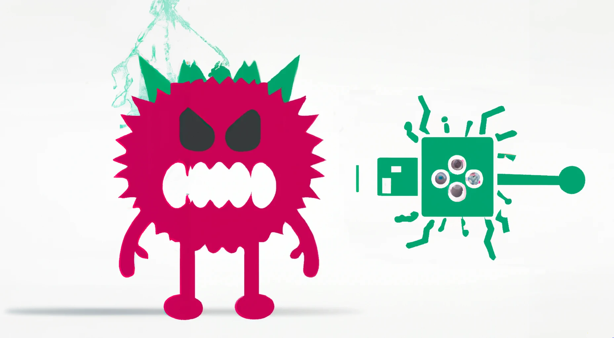

# Zuhause

## Welcome to the Raspirus Documentation

## Table of Contents:
- [Einführung](#introduction)
- [Installation](installation.md)
- [Anleitungen](guides.md)
- [FAQ](faq.md)
- [Usage and Diagrams](usage.md)
- [Developers Section](developers/index.md)
    - [Frontend (Next.js)](developers/frontend.md)
    - [Backend (Rust)](developers/backend.md)
- [Contributing](contributing/index.md)
    - [Coding](contributing/coding.md)
    - [Übersetzungen](contributing/translations.md)

## Einführung
Welcome to the Raspirus project documentation. This repository serves as a comprehensive guide to the Raspirus project. Please note that the project is currently under development, and while we strive for accuracy, some information may be subject to change.

## Related Projects
Raspirus is a simple and efficient virus scanner, specifically designed for compatibility with single-board computers like the Raspberry Pi. While there are several similar projects available, Raspirus stands out for its unique features and advantages. Here are some notable comparisons:

- [Clam AV](https://www.clamav.net/): Clam AV is an open-source antivirus program that can also perform file and folder scanning similar to Raspirus. However, it is known to be resource-intensive and relatively slow. Due to its high memory requirements, it may not be suitable for deployment on low-spec systems like the Raspberry Pi. Nonetheless, Clam AV remains a powerful open-source tool.

- [Windows Defender](https://www.microsoft.com/en-us/windows/comprehensive-security): Windows Defender is a comprehensive security program for Windows that continuously scans the entire system for threats. However, this continuous scanning process can significantly impact system performance. Additionally, Windows Defender is limited to the Windows operating system, whereas Raspirus is designed to be cross-platform, offering compatibility with various operating systems.

- [Bitdefender](https://www.bitdefender.com/): Bitdefender is a feature-rich commercial antivirus software solution. While it offers robust security capabilities, it comes at a cost. Raspirus, on the other hand, is committed to being a free and open-source project. We believe that security should be accessible to all users without the need for financial barriers. Furthermore, Raspirus aims to foster a collaborative community, leveraging the collective expertise of developers worldwide.

While there are numerous other antivirus solutions available, it's important to note that Raspirus does not seek to outperform or compete directly with other antivirus software. Instead, its primary focus is to excel at a specific task: comparing file hashes against a list of signatures.

Key features of Raspirus include:
- Free and open-source nature
- Transparent codebase for community review and scrutiny
- Emphasis on community-driven growth and development
- Cross-platform compatibility as a standard feature
- Lightweight and fast performance, ensuring usability even on low-spec devices

We invite you to explore the documentation further to gain a comprehensive understanding of the Raspirus project and its capabilities.