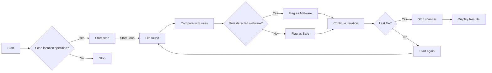
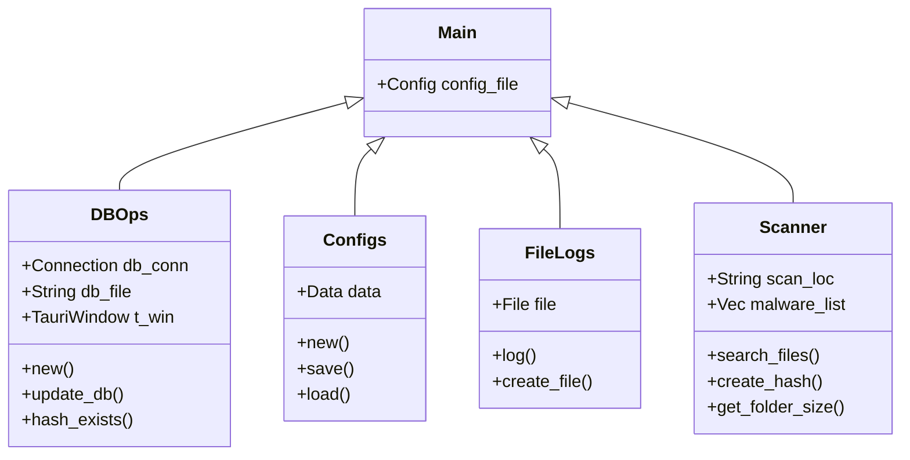

# Architecture

This page visualizes the general structure of the Raspirus project and its setup:

Generally, we use a frontend-backend architecture, with both components written in Rust. The frontend uses the iced-rs framework and communicates with the backend natively using Rust.

## Backend

## Frontend

### Home

### Scansione

### Risultato

### Configurazione Raspberry Pi

The visualization has evolved over the course of the project, but the page structure remains consistent.
