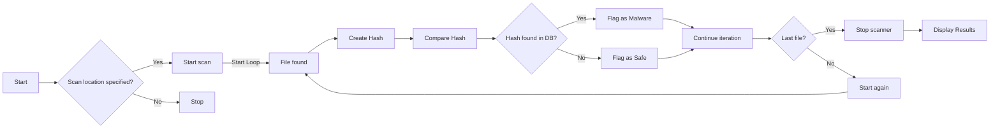
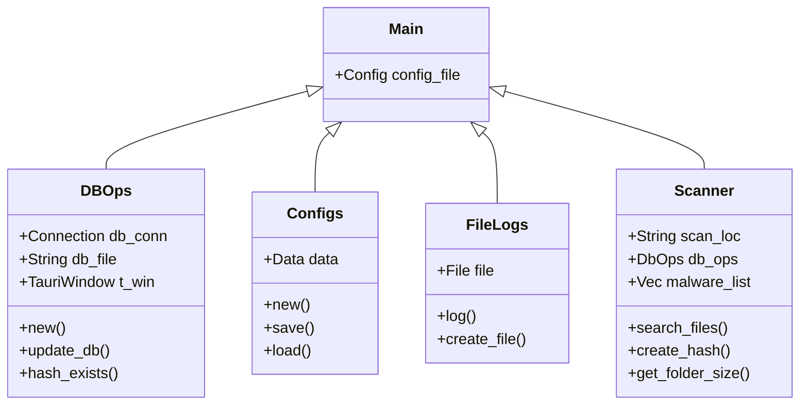

# DEVELOPERS

## Navigating the Architecture

Raspirus is structured into two integral components: frontend and backend. These components, built using distinct languages and frameworks, are interconnected via a third-party framework called [Tauri](https://tauri.app/). This framework not only facilitates communication between the frontend and backend but also enables us to incorporate Rust functions into the frontend. Furthermore, Tauri empowers the distribution of Raspirus across various operating systems.

## Starting Your Development Journey

=== "Windows"

     1. Clone the repository
     2. Install [Tauri and Prerequisites](https://tauri.app/v1/guides/getting-started/prerequisites#setting-up-windows)
     3. Install [npm](https://nodejs.org/en/download)
     4. Install [Next.js](https://nextjs.org/docs/getting-started/installation#manual-installation) with `npm install next@latest react@latest react-dom@latest`
     5. Install npm dependencies with: `npm i`
     6. Start development with `cargo tauri dev`
     7. or build Raspirus with `cargo tauri build`

=== "Linux"

     1. Clone the Repository
     2. Execute `make install`
     3. Run the application with `raspirus`

=== "macOS"

     1. Clone the repository
     2. Install [Tauri and Prerequisites](https://tauri.app/v1/guides/getting-started/prerequisites/#setting-up-macos)
     3. Install [npm](https://nodejs.org/en/download)
     4. Install [Next.js](https://nextjs.org/docs/getting-started/installation#manual-installation) with `npm install next@latest react@latest react-dom@latest`
     5. Install npm dependencies with: `npm i`
     6. Start development with `cargo tauri dev`
     7. or build Raspirus with `cargo tauri build`

Should you encounter any hiccups during your initial run or build, ensure that you've followed each step diligently. Confirm the accurate creation of both logs and config files.

## Exploring the Backend

The backend, an essential cog in the Raspirus machinery, is meticulously crafted in Rust for superior performance. The primary file houses functions accessible from the frontend, which must yield JSON-compatible outcomes. For a detailed breakdown, reference the graph above outlining the backend's modular arrangement.

## Unpacking the Frontend

<iframe title="The original Raspirus project on Figma" style="border: 1px solid rgba(0, 0, 0, 0.1);" width="800" height="450" src="https://www.figma.com/embed?embed_host=share&url=https%3A%2F%2Fwww.figma.com%2Ffile%2FpkgpwieNbhYiOi4Gz6Uyt6%2FRaspirus%3Fnode-id%3D0%253A1%26t%3DGr4YG3Ynv24YVlz2-1" allowfullscreen></iframe>

Our frontend, developed with JavaScript via the Next.js framework, emphasizes user-friendliness and functionality. Comprising components and pages, it mirrors the simplicity and robustness of Next.js. Refer to the illustrated graph above for an approximate visual representation of the frontend's architecture.

## Evaluating Test Coverage

- Backend tests, authored in Rust, can be executed via the `cargo test` command. Access these tests in the [tests directory](https://github.com/Raspirus/Raspirus/tree/main/src-tauri%2Fsrc%2Ftests). Check test coverage on [Codecov](https://app.codecov.io/gh/Raspirus/Raspirus).
- Frontend tests, created with Selenium, are currently in development.

Thank you for your interest in contributing to Raspirus's development. Your expertise fuels our progress.