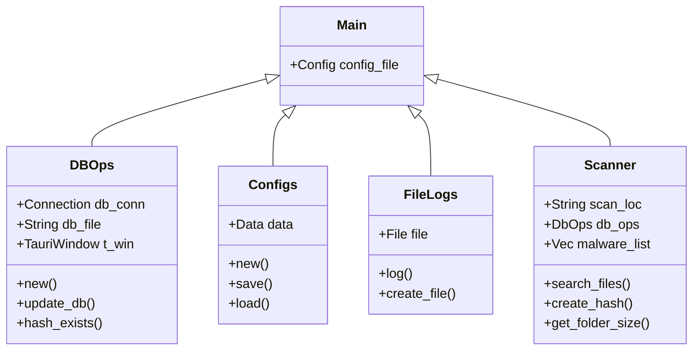

# SVILUPPI

## Navigare nell'Architettura

```mermaid
grafico LR
     A[Start] --> B{Posizione di scansione specificata? ;
     B --> Sì<unk> C[Start scan];
     C --> <unk> Start Loop<unk> D[File trovato];
     D --> E[Crea Hash];
     E --> F[Confronta Hash];
     F --> G{Hash trovato in DB? ;
     G --> <unk> Sì<unk> H[Contrassegna come malware];
     G --> <unk> No<unk> I[Contrassegna come sicuro];
     H & I --> J[Continue iteration];
     J --> K{Ultimo file? ;
     K --> <unk> Sì<unk> L[Stop scanner];
     L --> M[Display Results];
     K --> <unk> No<unk> N[Start again];
     N --> D;
     B --> <unk> No<unk> O[Stop]
```

Raspirus è strutturato in due componenti integrali: frontend e backend. Questi componenti, costruiti utilizzando linguaggi e quadri distinti, sono interconnessi tramite un framework di terze parti chiamato [Tauri](https://tauri.app/). Questo framework non solo facilita la comunicazione tra il frontend e il backend, ma ci permette anche di integrare le funzioni Rust nel frontend. Inoltre, Tauri consente la distribuzione di Raspirus su vari sistemi operativi.

## Iniziare Il Tuo Viaggio Di Sviluppo

\=== "Windows" Clone the repository
2\. 1. Clone the repository
2\. Install [Tauri and Prerequisites](https://tauri.app/v1/guides/getting-started/prerequisites#setting-up-windows)
3\. Install [npm](https://nodejs.org/en/download)
4\. Install [Next.js](https://nextjs.org/docs/getting-started/installation#manual-installation) with `npm install next@latest react@latest react-dom@latest`
5\. Install npm dependencies with: `npm i`
6\. Start development with `cargo tauri dev`
7\. o costruisci Raspirus con `cargo tauri build`

\=== "Linux" Clona il Repository
2\. Clone the Repository
2\. Execute `make install`
3\.  1. Clone the Repository
2\. Execute `make install`
3\. Run the application with `raspirus`

1. \=== "macOS" Clone the repository
   2\. Clone the repository
   2\. Install [Tauri and Prerequisites](https://tauri.app/v1/guides/getting-started/prerequisites/#setting-up-macos)
   3\. Install [npm](https://nodejs.org/en/download)
   4\. Install [Next.js](https://nextjs.org/docs/getting-started/installation#manual-installation) with `npm install next@latest react@latest react-dom@latest`
   5\. Install npm dependencies with: `npm i`
   6\. Start development with `cargo tauri dev`
   7\. o costruisci Raspirus con `cargo tauri build`

Se dovessi incontrare dei singhiozzi durante la tua esecuzione iniziale o costruire, assicurati di aver seguito diligentemente ogni passaggio. Confermare la creazione accurata di entrambi i log e file di configurazione.

## Esplorare il Backend



Il backend, un cog essenziale nella macchina Raspirus, è meticolosamente realizzato in Rust per prestazioni superiori. Il file primario ospita funzioni accessibili dal frontend, che devono produrre risultati compatibili con JSon. Per una ripartizione dettagliata, fare riferimento al grafico sopra che delinea la disposizione modulare del backend.

## Scompattare Frontend

<iframe title="The original Raspirus project on Figma" style="border: 1px solid rgba(0, 0, 0, 0.1);" width="800" height="450" src="https://www.figma.com/embed?embed_host=share&url=https%3A%2F%2Fwww.figma.com%2Ffile%2FpkgpwieNbhYiOi4Gz6Uyt6%2FRaspirus%3Fnode-id%3D0%253A1%26t%3DGr4YG3Ynv24YVlz2-1" allowfullscreen></iframe> 

Il nostro frontend, sviluppato con JavaScript tramite il framework Next.js, sottolinea la facilità d'uso e la funzionalità. Composto da componenti e pagine, rispecchia la semplicità e la robustezza di Next.js. Fare riferimento al grafico qui sopra illustrato per una rappresentazione visiva approssimativa dell'architettura del frontend.

## Valutazione Della Copertura Dei Test

- I test di backend, scritti in Rust, possono essere eseguiti tramite il comando `cargo test`. Accedi a questi test nella [directory test](https://github.com/Raspirus/Raspirus/tree/main/src-tauri%2Fsrc%2Ftest). Controlla la copertura del test su [Codecov](https://app.codecov.io/gh/Raspirus/Raspirus).
- I test Frontend, creati con Selenium, sono attualmente in fase di sviluppo.

Grazie per il vostro interesse a contribuire allo sviluppo di Raspirus. La vostra esperienza alimenta i nostri progressi.
